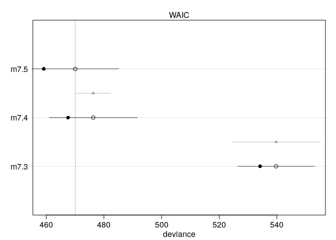
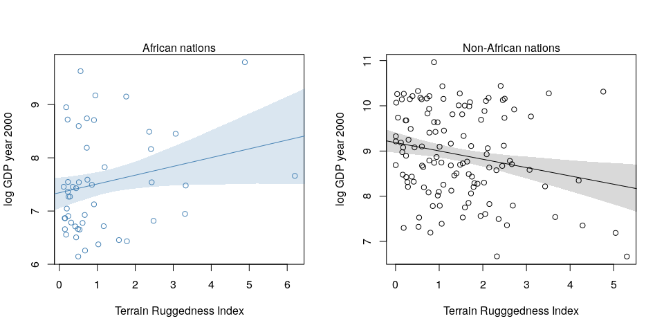
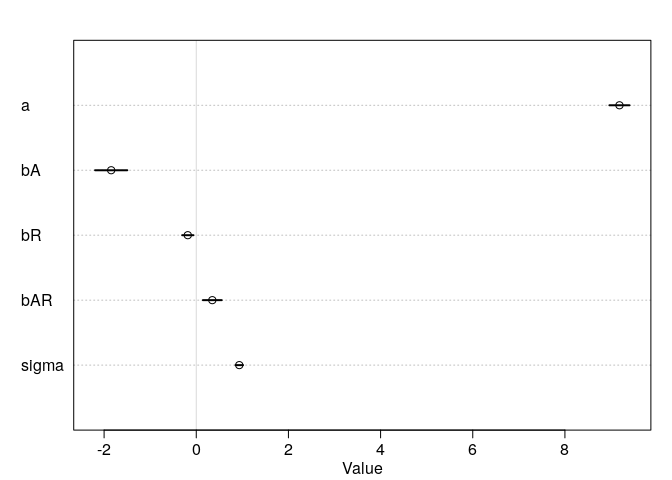
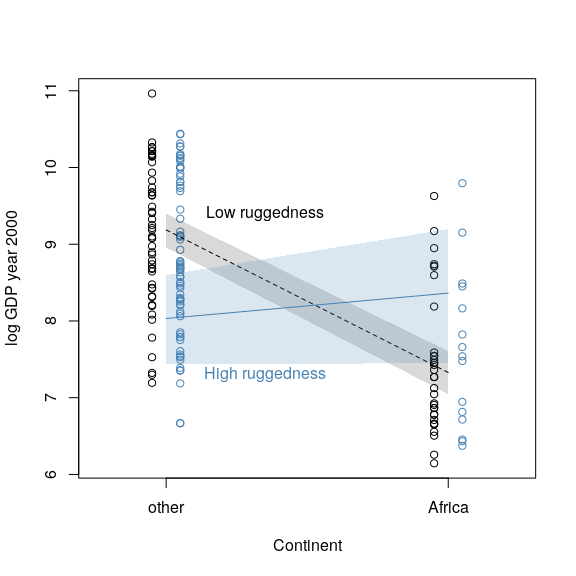
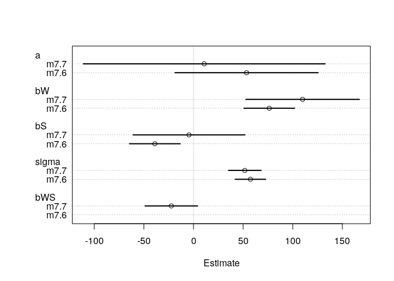
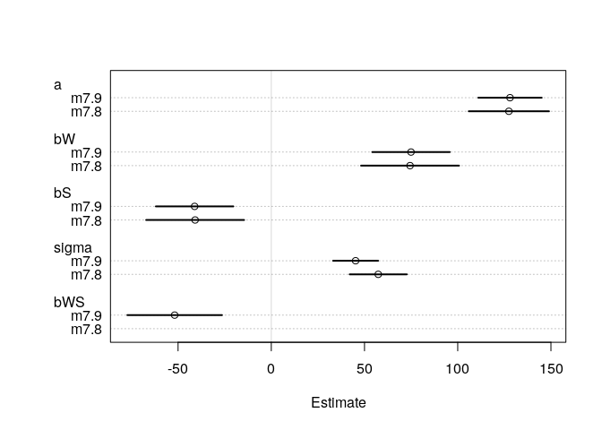
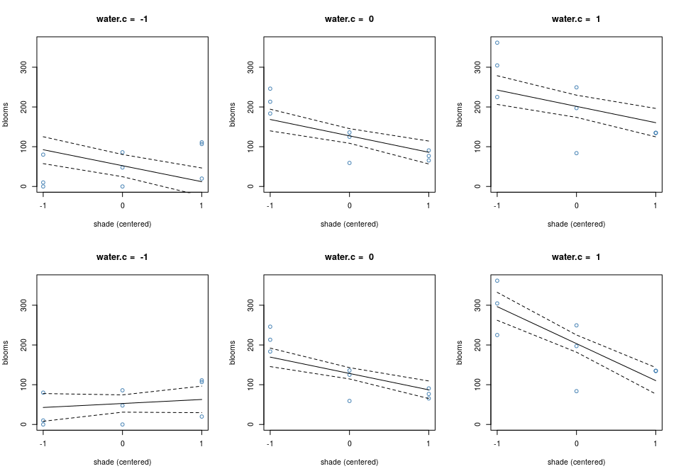
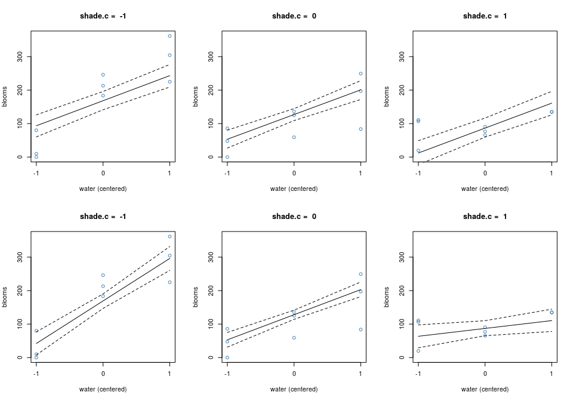

Chapter 7
================
Corrie
August 14, 2018

7.1 - Building an interaction
-----------------------------

``` r
library(rethinking)
data(rugged)
d <- rugged
```

How does terrain ruggedness influence the GDP?

``` r
# make log version of outcome
d$log_gdp <- log(d$rgdppc_2000)

dd <- d[ complete.cases(d$rgdppc_2000), ]

# split into Africa andnot-Africa
d.A1 <- dd[ dd$cont_africa == 1, ]
d.A0 <- dd[ dd$cont_africa == 0, ]
```

Make two model: one for Africa, one for non-Africa:

``` r
# Africa
m7.1 <- map(
  alist(
    log_gdp ~ dnorm( mu, sigma) ,
    mu <- a + bR*rugged ,
    a ~ dnorm(8, 100),
    bR ~ dnorm( 0, 1 ),
    sigma ~ dunif( 0, 10 )
  ), data=d.A1
)

# non-Africa
m7.2 <- map(
  alist(
    log_gdp ~ dnorm( mu, sigma ),
    mu <- a + bR*rugged ,
    a ~ dnorm( 8, 100),
    bR ~ dnorm( 0, 1),
    sigma ~ dunif( 0, 10 )
  ), data=d.A0
)
```

Make some plots:

``` r
rug.seq <- seq(from=-1, to=8, length.out = 30)
africa.mu <- link( m7.1, data=data.frame(rugged=rug.seq) )
```

    ## [ 100 / 1000 ]
    [ 200 / 1000 ]
    [ 300 / 1000 ]
    [ 400 / 1000 ]
    [ 500 / 1000 ]
    [ 600 / 1000 ]
    [ 700 / 1000 ]
    [ 800 / 1000 ]
    [ 900 / 1000 ]
    [ 1000 / 1000 ]

``` r
africa.mu.mean <- apply(africa.mu, 2, mean)
africa.mu.PI <- apply(africa.mu, 2, PI)

non.africa.mu <- link( m7.2, data=data.frame(rugged=rug.seq))
```

    ## [ 100 / 1000 ]
    [ 200 / 1000 ]
    [ 300 / 1000 ]
    [ 400 / 1000 ]
    [ 500 / 1000 ]
    [ 600 / 1000 ]
    [ 700 / 1000 ]
    [ 800 / 1000 ]
    [ 900 / 1000 ]
    [ 1000 / 1000 ]

``` r
non.africa.mu.mean <- apply(non.africa.mu, 2, mean)
non.africa.mu.PI <- apply(non.africa.mu, 2, PI)

par(mfrow=c(1,2))
plot( log_gdp ~ rugged, data=d.A1, col="steelblue")
lines(rug.seq, africa.mu.mean)
shade(africa.mu.PI, rug.seq)
mtext("Africa")

plot( log_gdp ~ rugged, data=d.A0, col="black")
lines(rug.seq, non.africa.mu.mean)
shade(non.africa.mu.PI, rug.seq)
mtext("not Africa")
```


Ruggedness seems to have different influence for countries outside and inside Africa, the slope is actually reversed! How can we capture the reversed slopes in a single model using all data?

A simple regression on all the data:

``` r
m7.3 <- map(
  alist(
    log_gdp ~ dnorm( mu, sigma),
    mu <- a + bR*rugged,
    a ~ dnorm( 8, 100),
    bR ~ dnorm(0, 1) ,
    sigma ~ dunif( 0, 10)
  ), data=dd
)
```

A regression with a dummy variable for African nations:

``` r
m7.4 <- map(
  alist(
    log_gdp ~ dnorm( mu, sigma ),
    mu <- a + bR*rugged + bA*cont_africa,
    a ~ dnorm( 8, 100),
    bR ~dnorm( 0, 1),
    bA ~ dnorm( 0, 1),
    sigma ~ dunif(0, 19)
  ), data=dd
)
```

Compare the two models:

``` r
compare( m7.3, m7.4)
```

    ##       WAIC pWAIC dWAIC weight    SE   dSE
    ## m7.4 476.3   4.4   0.0      1 15.36    NA
    ## m7.3 539.8   2.8  63.5      0 13.35 15.22

``` r
plot( compare( m7.3, m7.4 ))
```


The model with the dummy-variable does perform better than without. Let's plot the dummy-variable model.

``` r
# mu, fixing cont_africa=0
mu.NotAfrica <- link( m7.4, data=data.frame(rugged=rug.seq, cont_africa=0 ) )
```

    ## [ 100 / 1000 ]
    [ 200 / 1000 ]
    [ 300 / 1000 ]
    [ 400 / 1000 ]
    [ 500 / 1000 ]
    [ 600 / 1000 ]
    [ 700 / 1000 ]
    [ 800 / 1000 ]
    [ 900 / 1000 ]
    [ 1000 / 1000 ]

``` r
mu.NotAfrica.mean <- apply(mu.NotAfrica, 2, mean )
mu.NotAfrica.PI <- apply(mu.NotAfrica, 2, PI)

# mu, fixing cont_africa=1
mu.Africa <- link( m7.4, data=data.frame(rugged=rug.seq, cont_africa=1 ) )
```

    ## [ 100 / 1000 ]
    [ 200 / 1000 ]
    [ 300 / 1000 ]
    [ 400 / 1000 ]
    [ 500 / 1000 ]
    [ 600 / 1000 ]
    [ 700 / 1000 ]
    [ 800 / 1000 ]
    [ 900 / 1000 ]
    [ 1000 / 1000 ]

``` r
mu.Africa.mean <- apply( mu.Africa, 2, mean )
mu.Africa.PI <- apply( mu.Africa, 2, PI )

plot( log_gdp ~ rugged, data=d.A1, col="steelblue", 
      xlab="Terrain Ruggedness Index",
      ylim= range(dd$log_gdp))
points( log_gdp ~ rugged, data=d.A0, col="black")

lines(rug.seq, mu.Africa.mean, col="steelblue")
shade(mu.Africa.PI, rug.seq, col=col.alpha("steelblue"))
text(4, 6.8, "Africa", col="steelblue")

lines(rug.seq, mu.NotAfrica.mean, col="black")
shade(mu.NotAfrica.PI, rug.seq, col=col.alpha("black"))
text(4.5, 9.25, "not Africa")
```


The dummy-variable has only moved the intercept.

### Adding an interaction

``` r
m7.5 <- map(
  alist(
    log_gdp ~ dnorm(mu, sigma),
    mu <- a + gamma*rugged + bA*cont_africa,
    gamma <-bR + bAR*cont_africa,
    a ~ dnorm( 8, 100),
    bA ~ dnorm(0, 1),
    bR ~ dnorm(0, 1),
    bAR ~ dnorm( 0, 1),
    sigma ~ dunif( 0, 10)
  ), data=dd
)

compare( m7.3, m7.4, m7.5 )
```

    ##       WAIC pWAIC dWAIC weight    SE   dSE
    ## m7.5 470.0   5.4   0.0   0.96 15.12    NA
    ## m7.4 476.4   4.4   6.5   0.04 15.34  6.17
    ## m7.3 539.6   2.7  69.7   0.00 13.28 15.18

``` r
plot( compare( m7.3, m7.4, m7.5))
```



The interaction model performs better than the other two, though it only performs slightly better than the dummy variable: Since there are few countries in Africa, the data are sparse.

### Plotting interactions

``` r
mu.Africa <- link( m7.5, data=data.frame(cont_africa=1, rugged=rug.seq))
```

    ## [ 100 / 1000 ]
    [ 200 / 1000 ]
    [ 300 / 1000 ]
    [ 400 / 1000 ]
    [ 500 / 1000 ]
    [ 600 / 1000 ]
    [ 700 / 1000 ]
    [ 800 / 1000 ]
    [ 900 / 1000 ]
    [ 1000 / 1000 ]

``` r
mu.Africa.mean <- apply(mu.Africa, 2, mean)
mu.Africa.PI <- apply(mu.Africa, 2, PI)

mu.NotAfrica <- link( m7.5, data=data.frame(cont_africa=0, rugged=rug.seq))
```

    ## [ 100 / 1000 ]
    [ 200 / 1000 ]
    [ 300 / 1000 ]
    [ 400 / 1000 ]
    [ 500 / 1000 ]
    [ 600 / 1000 ]
    [ 700 / 1000 ]
    [ 800 / 1000 ]
    [ 900 / 1000 ]
    [ 1000 / 1000 ]

``` r
mu.NotAfrica.mean <- apply(mu.NotAfrica, 2, mean)
mu.NotAfrica.PI <- apply(mu.NotAfrica, 2, PI )

par(mfrow=c(1,2))
plot( log_gdp ~ rugged, data=d.A1,
      col="steelblue", ylab="log GDP year 2000",
      xlab="Terrain Ruggedness Index")
mtext("African nations")
lines(rug.seq, mu.Africa.mean, col="steelblue")
shade( mu.Africa.PI, rug.seq, col=col.alpha("steelblue"))

plot( log_gdp ~ rugged, data=d.A0,
      col="black", ylab="log GDP year 2000",
      xlab="Terrain Rugggedness Index")
mtext( "Non-African nations", 3)
lines( rug.seq, mu.NotAfrica.mean )
shade( mu.NotAfrica.PI, rug.seq )
```



The slope reverses! We can also overlap the plots:

``` r
plot( log_gdp ~ rugged, data=d.A1, col="steelblue", 
      xlab="Terrain Ruggedness Index",
      ylim=range(dd$log_gdp))
points( log_gdp ~ rugged, data=d.A0, col="black")

lines(rug.seq, mu.Africa.mean, col="steelblue")
shade( mu.Africa.PI, rug.seq, col=col.alpha("steelblue"))
text(4, 6.8, "Africa", col="steelblue")

lines( rug.seq, mu.NotAfrica.mean )
shade( mu.NotAfrica.PI, rug.seq )
text(4.5, 9.25, "not Africa")
```


``` r
plot( precis(m7.5) )
```



Gamma wasn't estimated, we have to compute it ourselves.

``` r
post <- extract.samples( m7.5 )
gamma.Africa <- post$bR + post$bAR*1
gamma.notAfrica <- post$bR + post$bAR*0

mean( gamma.Africa )
```

    ## [1] 0.1638634

``` r
mean( gamma.notAfrica )
```

    ## [1] -0.1846303

How do the distributions compare?

``` r
dens( gamma.Africa, xlim=c(-0.5, 0.6), ylim=c(0, 5.5),
      xlab="gamma", col="steelblue" )
dens( gamma.notAfrica, add=TRUE )
legend("topright", col=c("black", "steelblue"), bty="n", legend=c("not Africa", "Africa"))
```


``` r
diff <- gamma.Africa - gamma.notAfrica
sum( diff < 0 ) / length( diff )
```

    ## [1] 0.0034

So there is a very low probability that the African slope is less than the Non-African slope.

7.2 Symmetry of the linear interaction
--------------------------------------

The above interaction can be interpreted in two ways: (1) How much does the influece of ruggedness (on GDP) depend upon whether the nation is in Africa? (2) How much does the influence of being in Africa (on GDP) depend upon ruggedness?

Above, we plotted the first interpretation, which probably seems more natural for most. Let's plot the other one:

``` r
q.rugged <- range(dd$rugged)

mu.ruggedlo <- link( m7.5, 
                     data=data.frame(rugged=q.rugged[1], cont_africa=0:1) )
```

    ## [ 100 / 1000 ]
    [ 200 / 1000 ]
    [ 300 / 1000 ]
    [ 400 / 1000 ]
    [ 500 / 1000 ]
    [ 600 / 1000 ]
    [ 700 / 1000 ]
    [ 800 / 1000 ]
    [ 900 / 1000 ]
    [ 1000 / 1000 ]

``` r
mu.ruggedlo.mean <- apply(mu.ruggedlo, 2, mean)
mu.ruggedlo.PI <- apply(mu.ruggedlo, 2, PI)

mu.ruggedhi <- link( m7.5,
                     data=data.frame(rugged=q.rugged[2], cont_africa=0:1 ) )
```

    ## [ 100 / 1000 ]
    [ 200 / 1000 ]
    [ 300 / 1000 ]
    [ 400 / 1000 ]
    [ 500 / 1000 ]
    [ 600 / 1000 ]
    [ 700 / 1000 ]
    [ 800 / 1000 ]
    [ 900 / 1000 ]
    [ 1000 / 1000 ]

``` r
mu.ruggedhi.mean <- apply(mu.ruggedhi, 2, mean )
mu.ruggedhi.PI <- apply(mu.ruggedhi, 2, PI)

# plot everything
med.r <- median(dd$rugged)
ox <- ifelse(dd$rugged > med.r, 0.05, -0.05 )

plot( dd$cont_africa + ox, dd$log_gdp, 
      col=ifelse(dd$rugged > med.r, "steelblue", "black"),
      xlim = c(-0.25, 1.25), xaxt="n", 
      ylab ="log GDP year 2000",
      xlab = "Continent")

axis(1, at=c(0, 1), labels=c("other", "Africa"))
lines(0:1, mu.ruggedlo.mean, lty=2)
text(0.35, 9.4, "Low ruggedness", col="black")

shade(mu.ruggedlo.PI, 0:1 )
lines(0:1, mu.ruggedhi.mean, col="steelblue")
shade(mu.ruggedhi.PI, 0:1, col=col.alpha("steelblue"))
text(0.35, 7.3, "High ruggedness", col="steelblue")
```



Blue points are nations with above-median ruggedness. Black points are below the median. The dashed black line is the relationship between continent and log-GDP for an imaginary nation with minimum observed ruggedness (0.003). The blue line is an imaginary nation with maximum observed ruggedness (6.2).

That is, if we have a nation with low ruggedness and we "move" it to Africa, it's GDP goes down, whereas a nation with high ruggedness would see its GDP increase.

7.3 Continuous interactions
---------------------------

``` r
data(tulips)
d <- tulips
str(d)
```

    ## 'data.frame':    27 obs. of  4 variables:
    ##  $ bed   : Factor w/ 3 levels "a","b","c": 1 1 1 1 1 1 1 1 1 2 ...
    ##  $ water : int  1 1 1 2 2 2 3 3 3 1 ...
    ##  $ shade : int  1 2 3 1 2 3 1 2 3 1 ...
    ##  $ blooms: num  0 0 111 183.5 59.2 ...

Both wather and light help plants grow and produce blooms, so we can model this as an interaction. The difficulty for continuous interactions is how to interpret them.

Let's first implement two models, one with and one without interaction. This time, we use very flat priors.

``` r
m7.6 <- map(
  alist(
    blooms ~ dnorm(mu, sigma),
    mu <- a + bW*water + bS*shade,
    a ~ dnorm( 0, 100),
    bW ~ dnorm( 0, 100),
    bS ~ dnorm( 0, 100),
    sigma ~ dunif( 0, 100)
  ), data=d
)
```

    ## Error in map(alist(blooms ~ dnorm(mu, sigma), mu <- a + bW * water + bS * : non-finite finite-difference value [4]
    ## Start values for parameters may be too far from MAP.
    ## Try better priors or use explicit start values.
    ## If you sampled random start values, just trying again may work.
    ## Start values used in this attempt:
    ## a = -18.4528108537189
    ## bW = 23.3511606075218
    ## bS = -79.548237662344
    ## sigma = 49.8270272975788

``` r
m7.7 <- map(
  alist(
    blooms ~ dnorm( mu, sigma),
    mu <- a + bW*water + bS*shade + bWS*water*shade,
    a ~ dnorm(0, 100),
    bW ~ dnorm( 0, 100),
    bS ~ dnorm( 0, 100),
    bWS ~ dnorm( 0, 100),
    sigma ~ dunif( 0, 100)
  ), data=d
)
```

    ## Error in map(alist(blooms ~ dnorm(mu, sigma), mu <- a + bW * water + bS * : non-finite finite-difference value [5]
    ## Start values for parameters may be too far from MAP.
    ## Try better priors or use explicit start values.
    ## If you sampled random start values, just trying again may work.
    ## Start values used in this attempt:
    ## a = -57.769162340326
    ## bW = -166.085229081986
    ## bS = 112.788170757945
    ## bWS = 125.276761952353
    ## sigma = 52.3037425940856

Fitting this code very likely produces errors: The flat priors make it hard for the optimizer to find good startvalues that converge. We can fix this problem different ways:

-   use another optimizer
-   search longer, that is raise the maximumg iterations
-   rescale the data to make it easier to find the right values

We first try the first two options:

``` r
m7.6 <- map(
  alist(
    blooms ~ dnorm(mu, sigma),
    mu <- a + bW*water + bS*shade,
    a ~ dnorm( 0, 100),
    bW ~ dnorm( 0, 100),
    bS ~ dnorm( 0, 100),
    sigma ~ dunif( 0, 100)
  ), 
  data=d,
  method="Nelder-Mead",
  control=list(maxit=1e4)
)

m7.7 <- map(
  alist(
    blooms ~ dnorm( mu, sigma),
    mu <- a + bW*water + bS*shade + bWS*water*shade,
    a ~ dnorm(0, 100),
    bW ~ dnorm( 0, 100),
    bS ~ dnorm( 0, 100),
    bWS ~ dnorm( 0, 100),
    sigma ~ dunif( 0, 100)
  ), 
  data=d,
  method="Nelder-Mead",
  control=list(maxit=1e4)
)
```

No more warnings this time.

``` r
coeftab(m7.6, m7.7)
```

    ##       m7.6    m7.7   
    ## a       53.44  -84.38
    ## bW      76.38  151.17
    ## bS     -38.92   34.99
    ## sigma   57.39   46.31
    ## bWS        NA  -39.58
    ## nobs       27      27

``` r
plot( coeftab( m7.6, m7.7 ) )
```



The estimates are all over the place... The intercept changes from positive to negative in the second model. In the first model, both the water and shade coefficient are as expected: more water, more blooms and more shade less blooms. For shade, the influence actually becomes positive in the second model. The estimates are not that easy to understand and shouldn't be taken at face value.

``` r
compare( m7.6, m7.7 )
```

    ##       WAIC pWAIC dWAIC weight    SE  dSE
    ## m7.7 296.9   6.6   0.0   0.99 10.13   NA
    ## m7.6 306.2   5.5   9.3   0.01  9.13 6.21

Pretty much all weight is on the second model with interaction term, so it seems to be a better model than without interaction term.

### Center and re-estimate

Now, let's center the variables instead.

``` r
d$shade.c <- d$shade - mean(d$shade)
d$water.c <- d$water - mean(d$water)
```

Run the models again:

``` r
m7.8 <- map(
  alist(
    blooms ~ dnorm( mu, sigma),
    mu <- a + bW*water.c + bS*shade.c ,
    a ~ dnorm( 0, 100),
    bW ~ dnorm( 0, 100),
    bS ~ dnorm( 0, 100),
    sigma ~ dunif( 0, 100)
  ), 
  data=d,
  start=list(a=mean(d$blooms), bW=0, bS=0, sigma=sd(d$blooms))
)
m7.9 <- map(
  alist(
    blooms ~ dnorm( mu, sigma),
    mu <- a + bW*water.c + bS*shade.c + bWS*water.c*shade.c,
    a ~ dnorm(0, 100),
    bW ~ dnorm( 0, 100),
    bS ~ dnorm( 0, 100),
    bWS ~ dnorm( 0, 100),
    sigma ~ dunif( 0, 100)
  ), 
  data=d,
  start=list(a=mean(d$blooms), bW=0, bS=0, bWS=0,
             sigma=sd(d$blooms))
)
coeftab( m7.8, m7.9)
```

    ##       m7.8    m7.9   
    ## a      127.44  128.05
    ## bW      74.43   74.95
    ## bS     -40.85  -41.13
    ## sigma   57.37   45.23
    ## bWS        NA  -51.83
    ## nobs       27      27

``` r
plot( coeftab( m7.8, m7.9 ))
```



The estimates for both models look more reasonable: The intercept for both models is the same, it now corresponds to the average bloom. The influence of shade is also negative in both models now.

``` r
mean(d$bloom)
```

    ## [1] 128.9937

Just the estimates of the interaction model:

``` r
precis( m7.9 )
```

    ##         Mean StdDev   5.5%  94.5%
    ## a     128.05   8.68 114.19 141.92
    ## bW     74.95  10.60  58.00  91.89
    ## bS    -41.13  10.60 -58.08 -24.19
    ## bWS   -51.83  12.95 -72.53 -31.14
    ## sigma  45.23   6.15  35.39  55.07

### Plot continuous interactions

Let's plot the predictions. We make a plot showing the predictions for different values of water to get a feeling of the interaction effect.

``` r
par(mfrow=c(2,3))

shade.seq <- -1:1
# plot for model m7.8
for ( w in -1:1 ){
  dt <- d[d$water.c==w, ]
  plot(blooms ~ shade.c, data=dt, col="steelblue",
       main=paste("water.c = ", w), xaxp=c(-1,1,2),
       ylim=c(0, 362), xlab="shade (centered)")
  mu <- link( m7.8, data=data.frame(water.c=w, shade.c=shade.seq ) )
  mu.mean <- apply(mu, 2, mean)
  mu.PI <- apply( mu, 2, PI)
  lines( shade.seq, mu.mean )
  lines( shade.seq, mu.PI[1,], lty=2 )
  lines( shade.seq, mu.PI[2,], lty=2)
}
```

    ## [ 100 / 1000 ]
    [ 200 / 1000 ]
    [ 300 / 1000 ]
    [ 400 / 1000 ]
    [ 500 / 1000 ]
    [ 600 / 1000 ]
    [ 700 / 1000 ]
    [ 800 / 1000 ]
    [ 900 / 1000 ]
    [ 1000 / 1000 ]

    ## [ 100 / 1000 ]
    [ 200 / 1000 ]
    [ 300 / 1000 ]
    [ 400 / 1000 ]
    [ 500 / 1000 ]
    [ 600 / 1000 ]
    [ 700 / 1000 ]
    [ 800 / 1000 ]
    [ 900 / 1000 ]
    [ 1000 / 1000 ]

    ## [ 100 / 1000 ]
    [ 200 / 1000 ]
    [ 300 / 1000 ]
    [ 400 / 1000 ]
    [ 500 / 1000 ]
    [ 600 / 1000 ]
    [ 700 / 1000 ]
    [ 800 / 1000 ]
    [ 900 / 1000 ]
    [ 1000 / 1000 ]

``` r
# plot for model m7.9
for ( w in -1:1 ){
  dt <- d[d$water.c==w, ]
  plot(blooms ~ shade.c, data=dt, col="steelblue",
       main=paste("water.c = ", w), xaxp=c(-1,1,2),
       ylim=c(0, 362), xlab="shade (centered)")
  mu <- link( m7.9, data=data.frame(water.c=w, shade.c=shade.seq ) )
  mu.mean <- apply(mu, 2, mean)
  mu.PI <- apply( mu, 2, PI)
  lines( shade.seq, mu.mean )
  lines( shade.seq, mu.PI[1,], lty=2 )
  lines( shade.seq, mu.PI[2,], lty=2)
}
```

    ## [ 100 / 1000 ]
    [ 200 / 1000 ]
    [ 300 / 1000 ]
    [ 400 / 1000 ]
    [ 500 / 1000 ]
    [ 600 / 1000 ]
    [ 700 / 1000 ]
    [ 800 / 1000 ]
    [ 900 / 1000 ]
    [ 1000 / 1000 ]

    ## [ 100 / 1000 ]
    [ 200 / 1000 ]
    [ 300 / 1000 ]
    [ 400 / 1000 ]
    [ 500 / 1000 ]
    [ 600 / 1000 ]
    [ 700 / 1000 ]
    [ 800 / 1000 ]
    [ 900 / 1000 ]
    [ 1000 / 1000 ]



    ## [ 100 / 1000 ]
    [ 200 / 1000 ]
    [ 300 / 1000 ]
    [ 400 / 1000 ]
    [ 500 / 1000 ]
    [ 600 / 1000 ]
    [ 700 / 1000 ]
    [ 800 / 1000 ]
    [ 900 / 1000 ]
    [ 1000 / 1000 ]

In the top row, the model without the interaction, the slope for shade does not change, only the intercept. In the bottom row, the influece of shade changes, depending on how much water there is. If there is little water, the plant can't grow well, so no shade or a lot of shade doesn't change the bloom much. Whereas, if we have a more water, shade has a big difference, noticable in the steep slope. In all plots, the blue points are the data points that had the corresponding water value.

We can also visualize this the other way round:

``` r
par(mfrow=c(2,3))

water.seq <- -1:1
# plot for model m7.8
for ( s in -1:1 ){
  dt <- d[d$shade.c==s, ]
  plot(blooms ~ water.c, data=dt, col="steelblue",
       main=paste("shade.c = ", s), xaxp=c(-1,1,2),
       ylim=c(0, 362), xlab="water (centered)")
  mu <- link( m7.8, data=data.frame(water.c=water.seq, shade.c=s ) )
  mu.mean <- apply(mu, 2, mean)
  mu.PI <- apply( mu, 2, PI)
  lines( shade.seq, mu.mean )
  lines( shade.seq, mu.PI[1,], lty=2 )
  lines( shade.seq, mu.PI[2,], lty=2)
}
```

    ## [ 100 / 1000 ]
    [ 200 / 1000 ]
    [ 300 / 1000 ]
    [ 400 / 1000 ]
    [ 500 / 1000 ]
    [ 600 / 1000 ]
    [ 700 / 1000 ]
    [ 800 / 1000 ]
    [ 900 / 1000 ]
    [ 1000 / 1000 ]

    ## [ 100 / 1000 ]
    [ 200 / 1000 ]
    [ 300 / 1000 ]
    [ 400 / 1000 ]
    [ 500 / 1000 ]
    [ 600 / 1000 ]
    [ 700 / 1000 ]
    [ 800 / 1000 ]
    [ 900 / 1000 ]
    [ 1000 / 1000 ]

    ## [ 100 / 1000 ]
    [ 200 / 1000 ]
    [ 300 / 1000 ]
    [ 400 / 1000 ]
    [ 500 / 1000 ]
    [ 600 / 1000 ]
    [ 700 / 1000 ]
    [ 800 / 1000 ]
    [ 900 / 1000 ]
    [ 1000 / 1000 ]

``` r
# plot for model m7.9
for ( s in -1:1 ){
  dt <- d[d$shade.c==s, ]
  plot(blooms ~ water.c, data=dt, col="steelblue",
       main=paste("shade.c = ", s), xaxp=c(-1,1,2),
       ylim=c(0, 362), xlab="water (centered)")
  mu <- link( m7.9, data=data.frame(water.c=water.seq, shade.c=s ) )
  mu.mean <- apply(mu, 2, mean)
  mu.PI <- apply( mu, 2, PI)
  lines( shade.seq, mu.mean )
  lines( shade.seq, mu.PI[1,], lty=2 )
  lines( shade.seq, mu.PI[2,], lty=2)
}
```

    ## [ 100 / 1000 ]
    [ 200 / 1000 ]
    [ 300 / 1000 ]
    [ 400 / 1000 ]
    [ 500 / 1000 ]
    [ 600 / 1000 ]
    [ 700 / 1000 ]
    [ 800 / 1000 ]
    [ 900 / 1000 ]
    [ 1000 / 1000 ]

    ## [ 100 / 1000 ]
    [ 200 / 1000 ]
    [ 300 / 1000 ]
    [ 400 / 1000 ]
    [ 500 / 1000 ]
    [ 600 / 1000 ]
    [ 700 / 1000 ]
    [ 800 / 1000 ]
    [ 900 / 1000 ]
    [ 1000 / 1000 ]



    ## [ 100 / 1000 ]
    [ 200 / 1000 ]
    [ 300 / 1000 ]
    [ 400 / 1000 ]
    [ 500 / 1000 ]
    [ 600 / 1000 ]
    [ 700 / 1000 ]
    [ 800 / 1000 ]
    [ 900 / 1000 ]
    [ 1000 / 1000 ]

7.4 Interactions in design formulas
-----------------------------------

``` r
m7.x <- lm( y ~ x + z + x*z, data=d)
```

Same model:

``` r
m7.x <- lm( y ~ x*z, data=d)
```

Fit a model with interaction term but without direct effect:

``` r
m7.x <- lm( y ~ x + x*z - z, data=d)
```

Run a model with interaction term and all lower-order interactions:

``` r
m7.x <- lm( y ~ x*z*w, data=d)
```

corresponds to

 \\
\mu_i &= \alpha + \beta_x x_i + \beta_z z_i + \beta_w w_i + \beta_{xz} x_i z_i + \beta_{xw} x_i w_i + \beta_{zw} z_i w_w + \beta_{xzw} x_i z_i w_i
\end{align*}")

You can also get direct acces to the function used by `lm` to expand these formulas:

``` r
x <- z <- w <- 1
colnames( model.matrix(~ x*z*w ))
```

    ## [1] "(Intercept)" "x"           "z"           "w"           "x:z"        
    ## [6] "x:w"         "z:w"         "x:z:w"

where `:` stands for multiplication.
